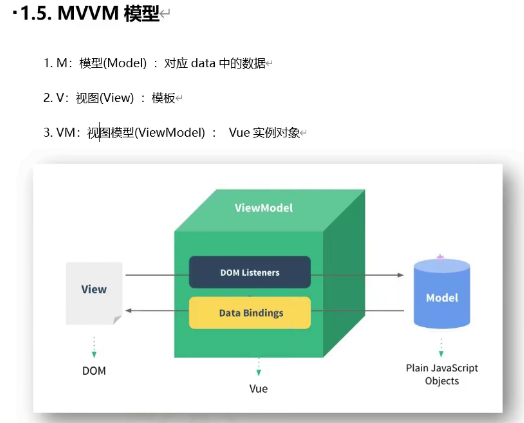

2021-12-21

p4 搭建 CDN 加速 体积更小 
上线 选择生产版本
Vue-devtools Vue调试工具
Vue 开发提示

p5 构建界面 live server 本地服务指向根目录

el 指定容器
data  配置数据

{{}} Vue 模板

Vue 实例解析语法

p6 
数据是动态的 不用操作DOM

不使用 Vue 关键字 底层提示

p7 v-bind 指令语法

p8 数据绑定
单向绑定 数据流向界面
双向绑定 数据流向界面 界面也可以修改数据 流向数据 v-model 只支持表单元素

p9
el 与 data 的相关语法

$ 可以使用的
_ 底层的

el 的两种写法 注入式 el:"root" 挂载式 $mount

data 的两种写法 对象式 data{} 函数式 data(){return{}}

```js
Vue.config.productionTip = false; //调整配置

// 挂载方式1

new Vue({
    el: "#root",
    //对象式 1
    data: {
        name: 'zs11',
        age: 333
    }

    //函数式  2
    // data(){
    //   console.log('this',this);

    //   return{}
    // }
}) //实例 维护数据 省去了 操作DOM赋值

// 负责容器部分
// 组件

// 挂载方式2 $mount

// console.log('x', x);
```

p10
MV VM模型

M data 
V 模板
VM 实例对象



p11
Object.defineProperty 应用

数据代理

数据劫持
计算属性

```js
 let num = 19;
 let obj = {
     name: "m",
     address: "aaa"
 }

 //颜色不同 不可枚举  
 //enumerable 默认值是false 是否可枚举 
 //writable默认值false 是否可修改 
 //configurable 默认值false 是否能删除

 //get函数
 //set函数 
 Object.defineProperty(obj, 'age', {
     get() {
         return num;
     },
     //读取obj的age属性时 就是触发get函数的调用 且返回值是age的值
     set(value) {
         num = value;
     }
 })
 console.log('obj', obj);

 // invoke 映射 property getter
 // (...) 值是映射过来的

 // Object.defineProperty将一个变量与对象关联起来 获取动态值
```

p12 
通过一个对象代理对另一个对象属性的操作(读/写)

数据代理

p13 。。。

data  === _data 

不做数据代理也能写代码 但是很繁琐

读取data里面的属性  把所有的属性添加到 VM实例对象上

2021-12-22

p14
事件处理

事件 $event

p15

a 标签跳转 
阻止事件默认行为 .prevent

阻止冒泡 .stop

只触发一次 .once

.capture 使用事件的捕获模式

.self 当前元素才触发

.passive 不用等待 回调函数执行完毕 再执行 而是立即执行 移动端项目使用多

引入两个事件的区别
@wheel 
@scroll

p16
键盘事件

tab 当前元素切走 特殊 必须配合keydown

meta win 徽标键 系统修饰键

ctrl alt shift meta

p17

修饰符可以连续写

@keyup.ctrl.y

p18
对比

只要数据发生改变 
一定会重新解析模板的

通过methods  效率不高

```js
const vm = new Vue({
    el: "#root",
    data() {
        return {
            firstName: "z",
            lastName: 's'
        }
    },
    methods: {
        fullName() {
            console.log('123');

            return this.firstName + "-" + this.lastName
        }
    }
})
```

p19
属性

计算属性 根据现有属性计算出全新属性 做了一个缓存 效率更高

配置项

1. 初次
2. 所依赖的数据发生改变

get 
set

p20
计算属性
只考虑读取 不考虑修改  可以采用简写

p21

先找实例对象
再找原型对象

@xxx = yyy  yyy 可以写一些简单的语句 比如取反

验证数据改变了 vm  但是页面没有用到 所以调试工具就没有改变

p21 监视属性

watch  

$watch

immediate

p22
监视多级结构 'obj.a'

watch 默认不能监听深层次改变 默认不开启 是为了提升效率

p23
深度监听
deep

p24
监听简写

只有handler  没有deep immediate 配置项时可以简写

p25

计算属性不能开启异步操作维护数据的

异步计算使用watch

js引擎

vue 管理的函数 最好写成普通函数

所有不被vue所管理的函数 最好写成箭头函数

this 指向vm实例对象

Math.floor(Math.random()*3) [0, 1, 2]; 

_loash

p26
模板干净

class 对象写法

p27
绑定style样式

p28 条件渲染
v-if   if else
v-show 

template 配合 v-if 使用 相当于空标签 当做不可见元素

2021-12-23

p29 
列表渲染

v-for  遍历数组 遍历对象

p30
key的作用和原理
key 写了 与不写？ 标识 提高真实DOM的复用
key 索引 还是ID好？ 分情况
key 仅仅在vue内部使用 在真实DOM中被干掉了 
key是虚拟DOM的标识

虚拟DOM在内存中

虚拟DOM 对比算法  决定是否复用

XXX 重点  对比虚拟DOM 决定是否更新真实DOM

效率低 真实DOM全部重新生成

1. 干巴巴
2. 制造问题看问题

数据破坏顺序 不适合使用key

ppt 
实时绘制

key 如果没有写自动 vue会自动补上

p31

#regin
#endregin 注释折叠

列表过滤

p32

列表排序

张天禹老师
https://www.bilibili.com/video/BV1wy4y1D7JT

p33
更新页面问题演示

p34
vue 检测对象改变的原理

p35
Vue.set()方法

2021-12-24
p36
数组
包裹数组更新
pop
push
shift
unshift
splice
reserve
sort 
改变原数组

p37
包裹数组更新
1. 更新数组 包裹数组更新
2. $set()

p38
v-model value的值

number
修饰符.number

v-model.number 自动转化为number类型

v-model.lazy 失去焦点再获取

v-model.trim 去除空格

p39
过滤器

p40
v-text

论文格式
抄袭的原因

30%
写作水平
系统中完成
提出问题 
分析问题
分析优劣势
解决问题
3-6部分

答辩PPT

13611315906

背景
现状

贡献性的
养老 xxx
住
物品添加条形码

知网查重

p41

7天免登录

Cookie-Editor

xss 冒充用户之手

p42
nodeJs

v-clock 没有使用Vue 则不显示该标签

p43
v-once 一次性

p44

v-pre  跳过编译 加快整体编译

p45
指令函数式

指令语法 解析标签

指令就是操作DOM

指令与元素成功绑定
指令在模板被重新解析时

p46
指定对象式
bind()
inserted()
update()

p47
1. 指令名
2. 指令里的this  指向window

p48
电脑马上烫手
指数大爆炸
引出生命周期

